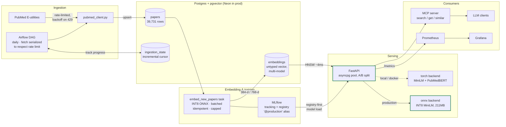
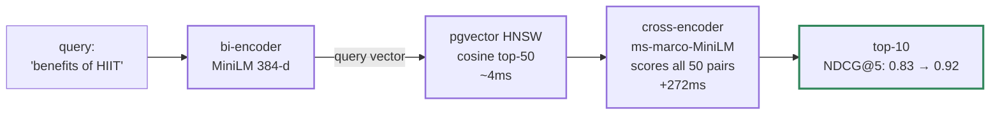
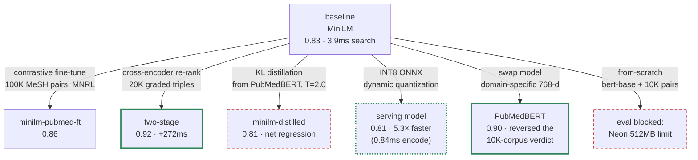
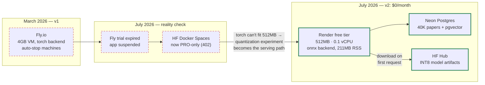
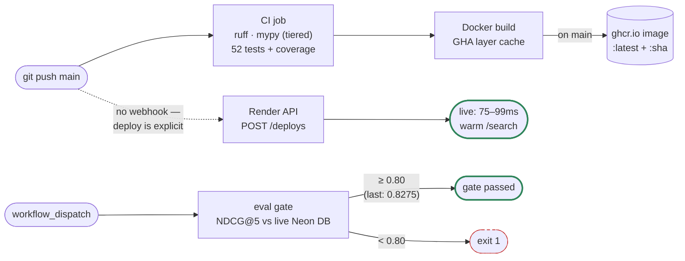
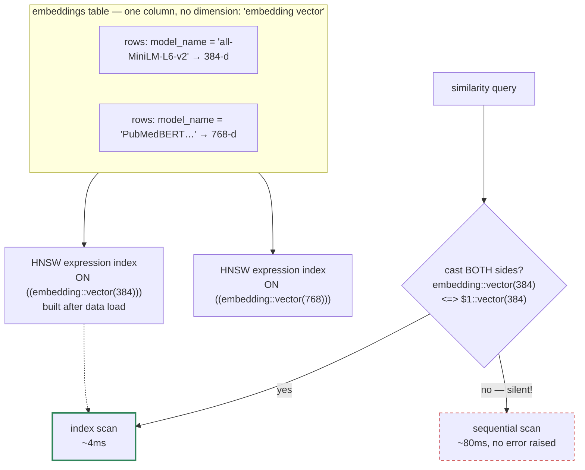

# PubMed ML Platform — Design Diagrams

Companion to the [portfolio dossier](portfolio-dossier.md). All numbers are measured (DEVLOG.md); Mermaid sources are blog-ready.

## 1. System architecture

## 2. Two-stage retrieval

## 3. Experiment tree (NDCG@5 on the 8-query MeSH-graded eval set)

Solid green = best quality. Dotted green = shipped to production (quality/memory trade-off). Red dashed = negative result / blocked — both documented, not hidden.

## 4. Deployment evolution

## 5. CI/CD with model-quality gate

## 6. The untyped-vector design (load-bearing schema decision)

**Why it matters:** one table serves every model comparison cleanly, at the cost of schema-level dimension safety — the 20× cast trap is invisible until you profile.
